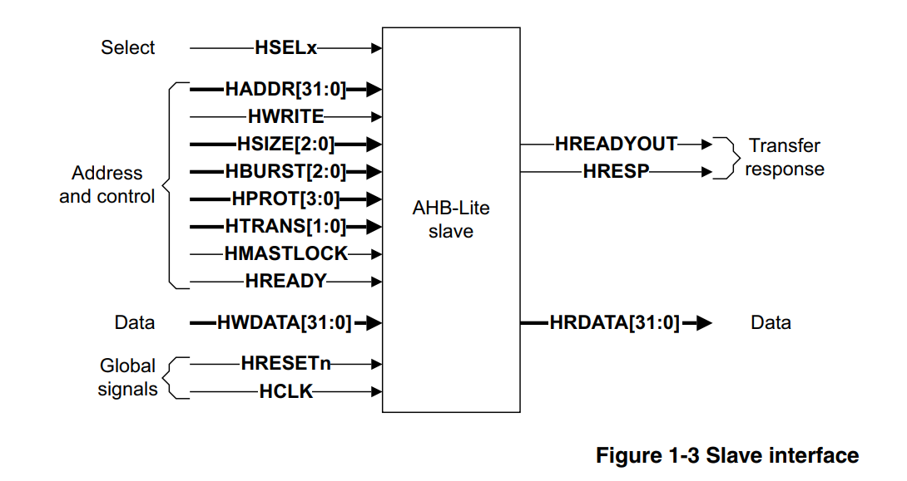
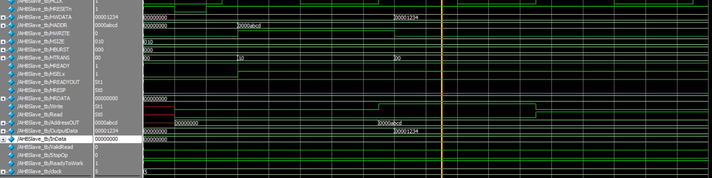
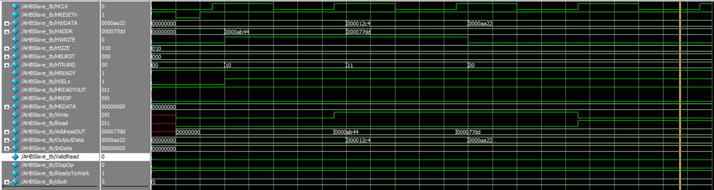
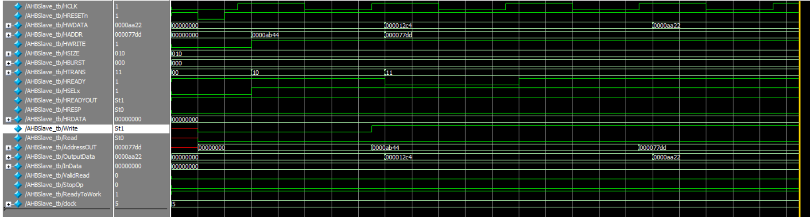
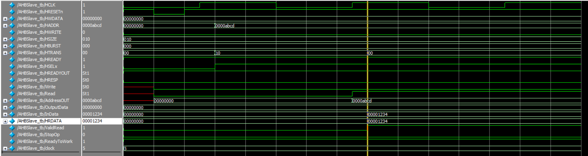

# AHB 
The **Advanced High-Performance Bus (AHB)** is part of ARM's **AMBA** standard, designed for fast, high-efficiency communication within system-on-chip (SoC) architectures. AHB supports high-speed data transfers between processors, memory, and peripherals, using a pipelined structure to minimize delays. It is ideal for embedded systems, enabling burst transfers, single-cycle memory access, and reliable error handling, making it crucial for applications requiring high performance and low power consumption.

*Figure 1: AHB Architectue*

---
## AMBA 
**AMBA** (Advanced Microcontroller Bus Architecture) is a widely used open-standard protocol developed by ARM to manage communication between different functional blocks within a **System-on-Chip (SoC)**. It ensures efficient data transfer between the processor, memory, and peripherals in embedded systems.

AMBA includes multiple bus protocols, each designed for different performance needs:
- **AHB (Advanced High-Performance Bus)**: Used for high-speed data transfers between processors and memory.
- **APB (Advanced Peripheral Bus)**: A simpler, lower-speed bus for peripherals like timers and UARTs.
- **AXI (Advanced eXtensible Interface)**: More advanced, supporting high-performance, parallel communication and flexibility in SoCs.

AMBA helps streamline system integration, enhance reusability, and improve system performance in embedded designs.

---
## AHB - Slave

An AHB slave is a crucial component in the Advanced High-Performance Bus (AHB) system, responsible for responding to read and write requests initiated by the AHB master. It processes the addresses and control signals generated by the master, either providing the requested data or accepting the data to be written. The slave does not initiate transactions but waits for commands from the master, handling data transfers to and from memory or other peripherals. The AHB slave's role is essential for ensuring smooth communication in high-speed systems, enabling efficient interaction with various devices on the bus.

*Figure 2: AHB Slave Architectue*

---

## Reference 
An AHB Slave will be designed to comply with the AMBA® 3 AHB-Lite Protocol v1.0 standard, ensuring compatibility and high performance. 

### Supported Features

- Single-Master Architecture
- Pipelined Operations
- Single-Cycle Data Transfers
- Burst Transfers
- Simple Handshake Mechanism
  - HREADY
  - HRESP
- Transfer Types
  - idle 
  - busy
  - non - sequential
  - sequential 
- Wait States Support
- Read and Write Operations

### Unsupported Features

- Multilayer AHB-Lite
- Protection (HPROT)
- Master lock (HMASTLOCK)
- WRAP4, INCR4, WRAP8, INCR8, WRAP8, INCR8 of HBURST

---
## External Interface Signals

Our design consists of five key blocks:

- **InData:** Read Data from external block like memory.
- **OutputData:** Write data into external block.
- **Write:** Write Enable.
- **Read:** Read enable.
- **AddressOUT:** intended Reading or Writng address. 
- **ValidRead:** Valid signal informs the slave when to read data from data bus.
- **StopOp:** Stop signal is asserted when slave tries to read from or write into a forbidden location .
- **ReadyToWork:** Ready signal is deasserted when data is not yet available, such as when attempting to read from an empty location or write to a full one.

---
## Verification and Simulation
During verification, I tested several features like read, write, and SRIO while `HREADY` was deasserted, and all operations were successfully completed.

*Figure 3: TC1 - Write *

*Figure 4: TC2 - Write Write *

*Figure 5: TC3 - HREADY Deasserted*

*Figure 5: TC4 - Read*

---
## Notes 

### The AHB slave external interface will be added at Integration assignment

---